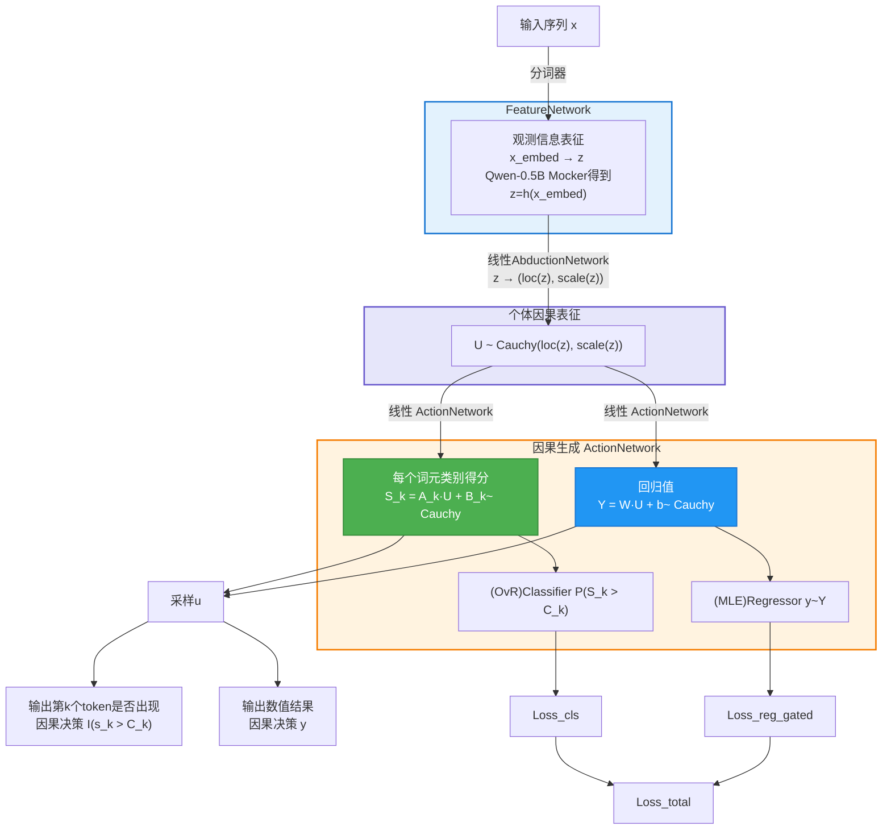
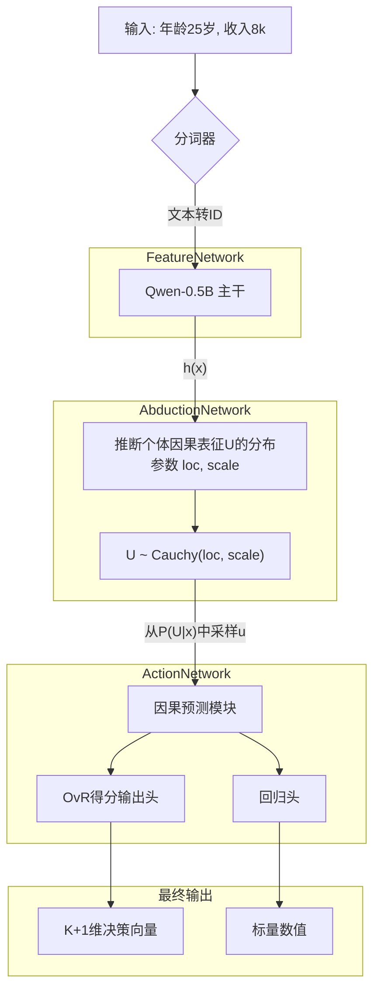

# CausalQwen-0.5B: 一个简化的因果语言模型架构

## 1. 概述

本文档旨在阐述一个理论完备且路径清晰的简化架构，用于将一个标准的大语言模型（如Qwen-0.5B）改造为一个**因果语言模型**。其核心目标是在LLM强大的符号推理能力之上，嫁接一个结构化的数值因果推断框架。

本架构是**V3"推断-行动"范式**的直接体现，它优先考虑工程实现的简洁性和因果原生设计。每一个组件都经过精心简化，以便能够快速验证其核心理论。

最终，该模型能够无缝处理混合数据任务，在统一的输出机制下，自主理解何时生成文本、何时进行数值回归。

---

## 2. 核心哲学：架构背后的"道"

我们的架构根植于几个区别于标准LLM的根本性原则。

### 2.1 "推断-行动"范式 (Abduction-Action Paradigm)

这是我们模型认知过程的核心两步：
1.  **推断 (Abduction):** 给定观测`x`，模型不直接预测结果。相反，它首先推断一个潜在高维**因果表征`U`**的概率分布`P(U|x)`。这个`U`代表了导致最终结果的、不可观测的"因果状态"或"因果画像"。
2.  **行动 (Action):** 模型接着从分布`P(U|x)`中采样一个具体的因果向量`u`。这个样本`u`成为所有后续预测的**唯一依据**，通过简单、直接的行动网络，同时驱动分类（文本生成）和回归（数值预测）。

### 2.2 柯西分布：认知不确定性的数学表达

我们特意选择**柯西分布(Cauchy Distribution)**来为`P(U|x)`建模。这不仅是技术选择，更是哲学考量。柯西分布的极重尾特性，是我们坚信"万事皆有可能"这一信念的数学化身。它确保了即使是极小概率的因果状态`U`也拥有非零的概率密度，这代表了一种鲁棒且开放的认知不确定性。

### 2.3 `<NUM>`词元：统一任务的桥梁

为了优雅地处理混合数据任务，我们引入了一个特殊的`<NUM>`词元。它在模型的词汇表中扮演了一个至关重要的桥梁角色，使得模型能够将"是否应该输出一个数值?"这个决策问题，视为一个标准的"下一词元预测"问题。这个设计是统一文本与数值输出的关键。

---

## 3. 简化架构：从理论到实现

我们通过对基座LLM（如Qwen-0.5B）进行最小化但功能强大的修改来实现目标。

### 3.1 整体结构

数据在模型中的流动遵循一个清晰的序列，如下图所示，它精确地区分了用于训练的解析路径和用于推理的采样路径：



### 3.2 输入处理与`<NUM>`词元

对于包含数值的输入，我们采用一个简化的融合机制。

- **分词:** 输入"价格是99.9"被分词。数字`99.9`被替换为特殊词元`<NUM>`，其真实值被分离开。
- **简化融合:** 为了结合`<NUM>`的语义和其精确值，我们使用一个简单的乘法调制。这可作为更复杂编码函数的占位符，但抓住了核心思想。
    \[
    \text{final\_embedding} = \text{embedding}(\text{<NUM>}) \cdot \sigma(\text{value})
    \]
    这里，`embedding(<NUM>)`提供了"此处是一个数字"的通用语义上下文，而`sigmoid(value)`则根据数值的大小对该embedding进行调制。

### 3.3 推断模块: 生成因果状态`P(U|x)`

这个模块连接了观测世界（文本）与潜在的因果世界。

- **输入:** LLM主干的最终隐藏状态`h(x)` (例如，Qwen-0.5B中维度为`[1, 1024]`的张量)。
- **功能:** 一个简单的线性层将`h(x)`映射到高维柯西分布`U`的参数。
    ```python
    # h(x) 的形状为 [batch, hidden_size]
    # causal_dim 是一个超参数, e.g., 64
    causal_inference_layer = nn.Linear(hidden_size, causal_dim * 2)
    
    # 输出形状为 [batch, causal_dim * 2]
    params = causal_inference_layer(h_x)
    
    # 分割为位置参数μ和尺度参数γ
    mu, log_gamma = torch.split(params, causal_dim, dim=-1)
    gamma = torch.exp(log_gamma) # 确保尺度参数为正
    ```

### 3.4 行动模块 (ActionNetwork)

因果表征的**随机变量`U`**是所有行动的统一驱动源。

- **主输出头 (分类):** 一个线性层将随机变量`U`映射为一个`K+1`维的**决策向量`S`**，其中`K`是原始词汇表大小。
    \[
    S_k = \vec{A}_k \cdot U + B_k, \quad \text{for } k \in \{0, 1, \dots, K\}
    \]
    其中`A`和`B`是可学习的权重和偏置。重要的是，这里的`U`是随机变量，因此`S_k`也是一个独立的柯西随机变量，代表了对类别`k`的决策得分。

- **辅助回归头:** 另一个线性层将 **同一个随机变量`U`** 映射到一个标量随机变量`Y`。
    \[
    Y = \vec{W} \cdot U + b
    \]
    `Y`同样是一个柯西随机变量。

**重要说明：训练与推理的区别**
-   **训练 (计算损失时)**：我们**不需要**对因果表征`U`进行采样。由于柯西分布的线性封闭性，我们可以直接从`U`的分布参数`(loc_u, scale_u)`解析地计算出决策分数`S_k`和回归值`Y`的分布参数，进而计算出精确的损失，整个过程是确定且可微的。
-   **推理 (生成预测时)**：当我们想得到一个具体的预测结果（例如，最可能的词元或一个具体的数值）时，更好的做法是直接使用我们解析计算出的概率和参数。对于分类，选择概率`P_k`最大的词元；对于回归，直接使用预测分布的中位数`loc_y`作为输出，这样更稳定且高效。仅在需要模拟真实世界随机性或进行探索性生成时，才考虑从`P(U|x)`中采样一个具体的实例`u`。

---

## 4. 训练策略: 因果原生损失函数

### 4.1 One-vs-Rest (OvR) 决策与概率

我们不使用Softmax，而是将多分类问题解构为`K+1`个独立的"一对剩余"二元决策问题。

- **决策原理:** 对每个类别`k`，我们计算其决策得分随机变量`S_k`大于一个可学习阈值`C_k`的概率（为简化，可设`C_k=0`）。
- **概率公式:** 利用柯西分布的累积分布函数(CDF)，我们可以得到一个解析的概率表达式。这一步无需采样，仅依赖分布参数：
    \[
    P_k = P(S_k > C_k) = \frac{1}{2} + \frac{1}{\pi} \arctan\left(\frac{\text{loc}_{S_k} - C_k}{\text{scale}_{S_k}}\right)
    \]
    其中`loc_Sk`和`scale_Sk`是决策分数`S_k`这个柯西变量的参数，可以由`U`的参数`(loc_u, scale_u)`和行动网络的权重解析地计算得出：
    \[
    \text{loc}_{S_k} = \vec{A}_k \cdot \text{loc}_u + B_k
    \]
    \[
    \text{scale}_{S_k} = |\vec{A}_k| \cdot \text{scale}_u
    \]

### 4.2 统一损失函数

总损失是分类损失和门控回归损失的加权和：
\[
\mathcal{L}_{\text{total}} = \mathcal{L}_{\text{cls}} + \lambda \cdot \mathcal{L}_{\text{reg\_gated}}
\]

1.  **分类损失 `L_cls`:**
    它是`K+1`个独立的二元交叉熵损失之和。对于真实标签为`j`的样本，`y_k`在`k=j`时为1，否则为0。
    \[
    \mathcal{L}_{\text{cls}} = - \sum_{k=0}^{K} \left[ y_k \log(P_k) + (1-y_k) \log(1-P_k) \right]
    \]

2.  **门控回归损失 `L_reg_gated`:**
    此损失仅对真实标签为`<NUM>`的样本激活，并由模型自身的预测置信度加权。
    - **回归基础损失 `L_cauchy_nll`:** 我们使用柯西分布的负对数似然(NLL)作为回归任务的基础损失，这与我们对`y`的柯西性质假设保持一致。
        \[
        \mathcal{L}_{\text{cauchy\_nll}} = \log(\pi \cdot \text{scale}_{\text{out}}) + \log\left(1 + \left(\frac{y_{\text{true}} - \text{loc}_{\text{out}}}{\text{scale}_{\text{out}}}\right)^2\right)
        \]
    - **门控机制:** "门"即模型预测类别为`<NUM>`的概率`P_<NUM>`。
        \[
        \mathcal{L}_{\text{reg\_gated}} = \mathbb{I}(y_{\text{true\_id}} = \text{<NUM>\_ID}) \cdot P_{\text{<NUM>}} \cdot \mathcal{L}_{\text{cauchy\_nll}}
        \]
    这个设计迫使模型必须先提升对`<NUM>`的预测概率（打开大门），才能有效优化回归损失，从而学会**先分类，再回归**。

---

## 5. 验证路径

为了初步验证，整个系统可以在"模拟模式"下进行测试，以隔离核心逻辑：
-   **模拟`h(x)`:** Qwen主干可以用正确形状的随机张量（如`torch.randn([batch_size, 1024])`）替代。
-   **合成数据:** 一个数据生成器可以创建`(fake_h_x, target_token_id, target_value)`的数据批次，允许我们在不受文本处理复杂性干扰的情况下，对因果引擎本身进行快速、可控的实验。

这个方法为从架构蓝图到可工作的概念验证提供了一条清晰、高效的路径。

---

## 附录

### 附录A：因果语言模型核心数学理论

#### A.1 柯西分布的关键性质

**定义与参数化**：
一维柯西分布的概率密度函数为：
\[
f(x; \mu, \gamma) = \frac{1}{\pi\gamma} \cdot \frac{1}{1 + \left(\frac{x-\mu}{\gamma}\right)^2}
\]
其中`μ`是位置参数（对应分布的中位数），`γ > 0`是尺度参数。

**重尾特性**：
柯西分布没有定义的均值和方差，这正是我们选择它的哲学原因：
- 极重的尾部确保了"任何结果都有非零概率"
- 数学上表达了对极端事件的开放态度
- 提供了天然的鲁棒性，对异常值不敏感

**线性组合的封闭性**：
这是柯西分布在我们架构中的核心数学优势。如果`U₁, U₂, ..., Uₙ`是独立的柯西随机变量：
\[
U_i \sim \text{Cauchy}(\mu_i, \gamma_i)
\]
那么它们的线性组合（代表了我们的`ActionNetwork`）：
\[
Y = \sum_{i=1}^n a_i U_i + b
\]
仍然是柯西分布：
\[
Y \sim \text{Cauchy}\left(\sum_{i=1}^n a_i \mu_i + b, \sum_{i=1}^n |a_i| \gamma_i\right)
\]
这个性质使得我们可以在不知道`U`具体采样值的情况下，仅通过其分布参数就能精确推导出输出的分布参数，这是无采样训练的理论基石。

#### A.2 重参数化技巧的数学原理

我们有时候可能需要从`P(U|x)`这个概率分布中进行采样，但采样操作本身是不可导的，这会阻断梯度的反向传播。**重参数化技巧(Reparameterization Trick)** 通过将随机性从网络参数中分离出去来解决此问题。我们不直接从`Cauchy(μ, γ)`中采样，而是从一个固定的、简单的分布（如`Uniform(0, 1)`）中采样一个噪声变量`ε`，然后通过一个确定性函数将其转换为我们想要的分布的样本。
    \[
    u = \mu + \gamma \cdot \tan\left(\pi \cdot (\epsilon - 0.5)\right), \quad \text{其中 } \epsilon \sim \text{Uniform}(0, 1)
    \]
    在这个公式中，`μ`和`γ`是网络的输出，梯度可以顺利地流经它们。随机性完全由外部的`ε`引入，而`ε`不参与梯度计算。这样，我们就构建了一条从损失函数到网络参数`μ`和`γ`的可微路径。在推理时，我们可以确定性地使用分布的中位数，即`μ`。


#### A.3 OvR分类的理论基础

**传统Softmax的局限**：
Softmax假设类别间互斥且概率和为1：
\[
P_k = \frac{\exp(z_k)}{\sum_{j=1}^K \exp(z_j)}
\]
这在处理"开放世界"问题时过于严格。

**OvR的优势**：
每个类别独立决策，允许：
- 多个类别同时为真
- 所有类别都为假的情况
- 更灵活的决策边界

**数学表述**：
对于决策分数`S_k ~ Cauchy(loc_k, scale_k)`，类别`k`的概率为：
\[
P_k = P(S_k > 0) = \frac{1}{2} + \frac{1}{\pi} \arctan\left(\frac{\text{loc}_k}{\text{scale}_k}\right)
\]

#### A.4 门控损失的数学合理性

**设计目标**：确保模型"先学分类，再优化回归"。

**数学机制**：
总损失中的回归项：
\[
\mathcal{L}_{\text{reg\_term}} = P_{\text{<NUM>}} \cdot \mathcal{L}_{\text{cauchy\_nll}}
\]

**优化动态**：
- 当`P_<NUM>`很小时，回归损失贡献微弱
- 模型必须先提高`P_<NUM>`（学会分类）
- 只有`P_<NUM>`足够大，回归优化才有效果
- 这种耦合确保了学习的层次性

### 附录B：后续开发计划


当前架构因果生成视角简化版本：




**阶段1：验证核心机制**
- 使用本附录B的简化实现
- 在合成数据上验证收敛性
- 确认OvR分类和门控损失的有效性

**阶段2：集成真实特征网络**
- 替换`mock_feature_network`为真实的Qwen主干
- 添加`<NUM>`词元处理逻辑
- 实现真实的数值编码机制

**阶段3：端到端优化**
- 在真实混合数据集上训练
- 性能调优和超参数搜索
