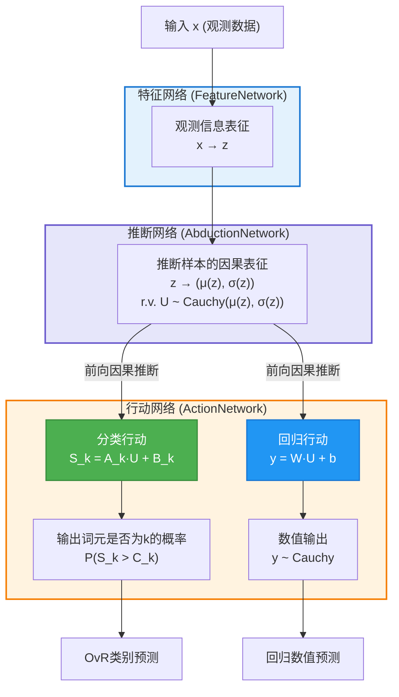

# 基于因果推断行动分类回归的统一大模型架构 V3

## 1. 愿景：回归本质的统一因果框架

在前两个版本的探索中，我们分别尝试了分离式设计和基于可逆神经网络的统一框架。经过深入思考和实验验证，我们发现最优雅且实用的方案应该回归因果推理的本质——直接从因果表征出发，通过"推断-行动"机制实现分类和回归任务。

本版本架构完全去除了可逆神经网络（INN）的复杂性，采用了在[CAAC项目](https://github.com/1587causalai/caac)和[CAAR项目](https://github.com/1587causalai/caar)中验证的成熟方法，构建了一个既简洁又强大的统一因果大模型。

## 2. 核心架构设计

### 2.1 统一因果架构：推断与行动

下图精确地展示了本方案的统一因果大模型架构。其核心思想是：首先通过特征网络处理观测数据，提取观测信息表征 `z`；然后由推断网络 (AbductionNetwork) 基于 `z` 估计共享的、潜在随机因果表征 `U` (代表样本/单元的内在"基因") 的分布参数；采样得到 `U` 后，再由行动网络 (ActionNetwork) 基于 `U` 进行前向的因果推断，统一驱动分类和回归任务。



**关键设计理念**：
- **观测数据表征**：特征网络从观测数据 `x` 中提取确定性的观测信息表征 `z`。
- **内在因果推断**：推断网络基于观测信息 `z`，推断出不可直接观测的、样本/单元内在随机因果表征 `U`（"基因"）的分布参数。
- **共享随机核心 `U`**：`U` 是连接后续所有任务的、统一的随机因果变量。
- **行动基于 `U`**：行动网络基于采样得到的 `U` 进行前向因果推断，执行具体的分类或回归行动。
- **推断与行动分离**：清晰区分了"AbductionNetwork" (反向推断`U`的分布) 和 "ActionNetwork" (基于`U`前向执行因果行动)。

### 2.2 关键组件详解

#### 2.2.1 特征网络 (FeatureNetwork)

**角色**：处理原始输入（观测数据）$x$，提取其确定性的高维观测信息表征 $z(x)$。

**功能**：
$$ z(x) = \text{FeatureNetwork}(x) $$

其中 $x \in \mathbb{R}^{\text{input\_dim}}$，$z(x) \in \mathbb{R}^D$。

**实现**：通常为一个或多个神经网络层（如MLP、CNN、Transformer编码层等），具体结构根据输入数据类型和任务需求调整。

#### 2.2.2 推断网络 (AbductionNetwork)

**角色**：基于观测信息表征 $z(x)$，推断不可直接观测的、样本/单元内在随机因果表征 $\vec{U}$ (基因) 的柯西分布参数。

**功能**：输出 $\vec{U}$ 的 $M$-维位置参数向量 $\vec{\mu}(z)$ 和 $M$-维尺度参数向量 $\vec{\sigma}(z)$。

$$ \vec{\mu}(z), \vec{\sigma}(z) = \text{AbductionNetwork}(z(x)) $$

其中 $\vec{U} \in \mathbb{R}^M$，所以 $\vec{\mu}(z) \in \mathbb{R}^M$ 且 $\vec{\sigma}(z) \in \mathbb{R}_+^M$ (尺度参数恒为正)。

**实现**：通常由一个共享的神经网络主干和两个独立的头部网络组成：
-   **位置参数头 (Location Head)**：$z(x) \rightarrow \vec{\mu}(z)$
-   **尺度参数头 (Scale Head)**：$z(x) \rightarrow \vec{\sigma}(z)$。为保证尺度参数为正，通常在输出层使用如 Softplus 激活函数。

#### 2.2.3 随机因果表征采样

**角色**：从推断网络 (AbductionNetwork) 输出的柯西分布中，采样得到随机因果表征 $\vec{U}$ 的一个实例。

**功能**：假设 $\vec{U}$ 的各分量 $U_j$ 相互独立，则每个分量 $U_j$ 从其对应的柯西分布中采样：

$$ U_j \sim \text{Cauchy}(\mu_j(z), \sigma_j(z)), \quad j=1, \dots, M $$

**实现 (训练时)**：为保证端到端可微训练，常采用重参数化技巧 (reparameterization trick)：

$$ U_j = \mu_j(z) + \sigma_j(z) \cdot \tan(\pi(\epsilon_j - 0.5)) $$

其中 $\epsilon_j \sim \text{Uniform}(0,1)$ 是从标准均匀分布中采样的随机数。

**实现 (推理时)**：可采样多次以获得更稳定的估计，或直接使用分布的位置参数。注意：柯西分布的数学期望不存在，但位置参数 $\mu_j(z)$ 对应分布的中位数。在实践中，如果需要点估计，通常使用位置参数 $\mu_j(z)$ 作为 $\vec{U}$ 的代表值，或者进行多次采样并对后续任务的输出进行平均。

## 3. 分类任务：CAAC方法

### 3.1 核心原理

基于"因果推断-行动分类"范式，从因果表征 $\vec{U}$ 通过线性变换映射到决策空间，再通过阈值比较得到分类概率。

### 3.2 行动网络结构

**线性变换层**：
$$S_k = \sum_{j=1}^{D} A_{kj} \cdot U_j + B_k$$

其中：
- $A \in \mathbb{R}^{K \times D}$：可学习的行动矩阵
- $B \in \mathbb{R}^K$：可学习的偏置向量
- $S_k$：第k类的决策得分（柯西随机变量）

**概率计算**：
$$P(Y = k|x) = P(S_k > C_k) = \frac{1}{2} + \frac{1}{\pi} \arctan\left(\frac{\mu_{S_k} - C_k}{\sigma_{S_k}}\right)$$

其中：
- $\mu_{S_k} = \sum_{j=1}^{D} A_{kj} \cdot \mu_j + B_k$：$S_k$ 的位置参数（柯西分布的中位数）
- $\sigma_{S_k} = \sum_{j=1}^{D} |A_{kj}| \cdot \sigma_j$：$S_k$ 的尺度参数  
- $C_k$ 是可学习的决策阈值（默认为0）

### 3.3 损失函数

使用负对数似然损失：
$$L_{class} = -\sum_{i=1}^{N} \sum_{k=1}^{K} y_{i,k} \log P(Y_k = 1|x_i)$$

### 3.4 关键优势

1. **鲁棒性**：柯西分布的厚尾特性提供对异常值的天然抗性
2. **不确定性量化**：$\sigma_i(z)$ 直接反映决策的不确定程度
3. **理论基础**：基于因果推理的坚实理论基础

## 4. 回归任务：CAAR方法

### 4.1 核心原理

采用"因果推断-行动回归"范式，将因果表征通过线性变换直接映射到数值输出空间。

### 4.2 回归网络结构

**线性映射层**：
$$y_{num} = \sum_{j=1}^{D} W_j \cdot U_j + b$$

其中：
- $W \in \mathbb{R}^D$：可学习的回归权重向量
- $b \in \mathbb{R}$：可学习的偏置标量
- $y_{num}$：数值输出（柯西随机变量）

### 4.3 输出分布

由于 $U_j$ 都是独立的柯西分布，线性组合 $y_{num}$ 仍服从柯西分布：

$$y_{num} \sim \text{Cauchy}\left(\mu_{out}, \sigma_{out}\right)$$

其中：
- $\mu_{out} = \sum_{j=1}^{D} W_j \cdot \mu_j(z) + b$
- $\sigma_{out} = \sum_{j=1}^{D} |W_j| \cdot \sigma_j(z)$

### 4.4 损失函数

使用柯西分布的负对数似然：
$$L_{reg} = \sum_{i=1}^{N} \left[\log(\pi \sigma_{out,i}) + \log\left(1 + \left(\frac{y_{true,i} - \mu_{out,i}}{\sigma_{out,i}}\right)^2\right)\right]$$

### 4.5 优势特点

1. **重尾建模**：自然处理数值数据中的极值情况
2. **参数可解释**：$\mu_{out}$ 表示位置参数（中位数），$\sigma_{out}$ 表示尺度参数（反映不确定性）
3. **数值稳定**：柯西分布具有良好的数值计算性质

## 5. 统一训练策略

### 5.1 任务自适应机制

引入任务指示符 $T \in \{\text{classification}, \text{regression}\}$，模型根据任务类型选择相应的输出头：

```python
def forward(self, x, task_type):
    h = self.transformer(x)
    z = self.feature_network(h)
    mu, sigma = self.abduction_network(z)
    U = self.sample_causal_repr(mu, sigma)
    
    if task_type == "classification":
        return self.caac_head(U)
    elif task_type == "regression":
        return self.caar_head(U)
    else:  # 统一输出模式
        return {
            "classification": self.caac_head(U),
            "regression": self.caar_head(U)
        }
```

### 5.2 多任务学习损失

总损失函数为分类和回归损失的加权组合：
$$L_{total} = \lambda_{class} \cdot L_{class} + \lambda_{reg} \cdot L_{reg} + \lambda_{consist} \cdot L_{consist}$$

其中 $L_{consist}$ 是一致性正则化项，确保不同任务共享的因果表征具有一致性。

### 5.3 一致性正则化

为了确保分类和回归任务学到一致的因果表征，我们引入KL散度正则化：

$$L_{consist} = \text{KL}\left[P(\vec{U}|x, \text{class}) || P(\vec{U}|x, \text{reg})\right]$$

实际实现中，我们约束两个任务的因果推断网络参数相同或相近。

## 6. 实现细节与配置

### 6.1 标准网络配置

**特征网络**：
```python
feature_network = nn.Sequential(
    nn.Linear(transformer_dim, 512),
    nn.ReLU(),
    nn.Linear(512, 256), 
    nn.ReLU(),
    nn.Linear(256, representation_dim)  # 默认128
)
```

**推断网络**：
```python
shared_trunk = nn.Sequential(
    nn.Linear(representation_dim, 256),
    nn.ReLU(), 
    nn.Linear(256, 128),
    nn.ReLU(),
    nn.Linear(128, 64)
)

location_head = nn.Linear(64, latent_dim)  # 默认128
scale_head = nn.Sequential(
    nn.Linear(64, latent_dim),
    nn.Softplus()  # 确保输出为正
)
```

**CAAC分类头**：
```python
caac_head = nn.Linear(latent_dim, num_classes)  # A矩阵和B向量
decision_thresholds = nn.Parameter(torch.zeros(num_classes))  # 可选
```

**CAAR回归头**：
```python
caar_head = nn.Linear(latent_dim, 1)  # W向量和b标量
```

### 6.2 训练超参数

```python
# 基础设置
learning_rate = 1e-3
batch_size = 64
max_epochs = 150
early_stopping_patience = 15

# 损失权重
lambda_class = 1.0
lambda_reg = 1.0
lambda_consist = 0.1

# 网络维度
representation_dim = 128
latent_dim = 128  # 因果表征维度
```

### 6.3 采样配置

```python
# 训练时采样
num_samples_train = 1  # 单次采样，通过重参数化

# 推理时采样  
num_samples_inference = 10  # 多次采样取平均
use_mean_for_inference = True  # 或直接使用均值
```

## 7. 理论优势与创新点

### 7.1 相比V2版本的改进

1. **简化架构**：去除了复杂的INN变换，回归因果推理本质
2. **成熟方法**：基于CAAC和CAAR项目验证的实用算法
3. **更好的可解释性**：每个组件都有明确的因果语义
4. **数值稳定性**：避免了INN的雅可比计算和可逆性约束

### 7.2 统一框架的优势

1. **共享因果表征**：分类和回归共享相同的因果推断机制
2. **端到端学习**：整个架构完全可微，支持联合优化
3. **任务灵活性**：可以处理纯分类、纯回归或混合任务
4. **鲁棒性保证**：柯西分布提供天然的抗干扰能力

### 7.3 理论创新

1. **因果推断统一化**：将不同类型的输出任务统一到因果推理框架下
2. **柯西分布建模**：充分利用柯西分布的厚尾和线性组合性质
3. **推断-行动分离**：清晰分离因果推断和任务执行，增强可解释性

## 8. 扩展方向

### 8.1 多模态扩展

- **视觉-语言统一**：Transformer主干支持图像+文本输入
- **跨模态因果推理**：学习跨模态的共享因果表征
- **统一输出空间**：文本生成、图像分类、数值预测的统一处理

### 8.2 大规模预训练

- **自监督预训练**：在大规模无标签数据上预训练因果表征
- **任务迁移**：预训练的因果表征可迁移到不同下游任务
- **知识蒸馏**：从大模型向小模型传递因果推理能力

### 8.3 实时学习

- **在线更新**：支持流式数据的因果表征实时更新
- **增量学习**：新任务不会干扰已学习的因果机制
- **自适应阈值**：决策阈值根据数据分布自动调整

## 9. 实验验证计划

### 9.1 基准测试

1. **分类任务**：GLUE、SuperGLUE等NLP基准
2. **回归任务**：数值预测、时间序列回归
3. **混合任务**：同时包含分类和回归的复合数据集

### 9.2 鲁棒性评估

1. **噪声鲁棒性**：标签噪声、特征噪声下的性能
2. **分布偏移**：域适应和泛化能力测试
3. **对抗攻击**：对抗样本下的模型稳定性

### 9.3 可解释性分析

1. **因果表征可视化**：t-SNE、PCA等降维可视化
2. **决策过程分析**：从因果推断到最终决策的路径追踪
3. **不确定性量化**：模型置信度与实际性能的相关性

## 10. 总结

V3架构通过去除复杂的INN机制，采用成熟验证的CAAC和CAAR方法，构建了一个既简洁又强大的统一因果大模型。这一设计不仅保持了因果推理的理论优势，更在实用性和可解释性方面取得了显著提升。

关键特点：
- ✅ **架构简洁**：清晰的"推断-行动"两阶段设计
- ✅ **理论坚实**：基于因果推理和柯西分布的数学基础
- ✅ **实验验证**：CAAC和CAAR项目的成功验证
- ✅ **统一框架**：分类和回归任务的自然统一
- ✅ **工程友好**：避免复杂的数值计算，便于实现和调试

这一架构为构建下一代因果智能系统奠定了坚实的基础。 