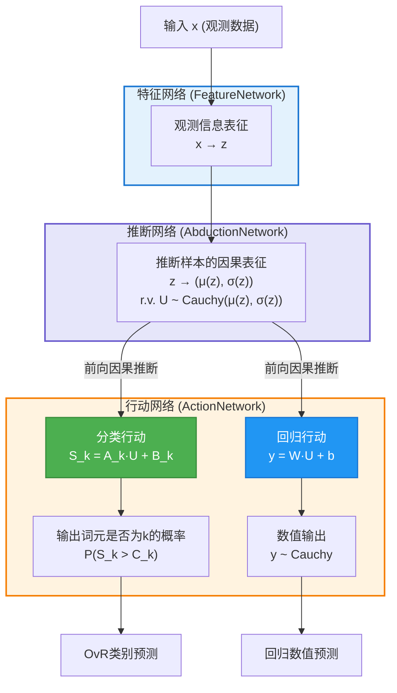

# 基于因果推断行动分类回归的统一大模型架构 V3

## 1. 愿景：回归本质的统一因果框架

在前两个版本的探索中，我们分别尝试了分离式设计和基于可逆神经网络的统一框架。经过深入思考和实验验证，我们发现最优雅且实用的方案应该回归因果推理的本质——直接从因果表征出发，通过"推断-行动"机制实现分类和回归任务。

本版本架构完全去除了可逆神经网络（INN）的复杂性，采用了在[CAAC项目](https://github.com/1587causalai/caac)和[CAAR项目](https://github.com/1587causalai/caar)中验证的成熟方法，构建了一个既简洁又强大的统一因果大模型。

## 2. 核心架构设计

### 2.1 统一因果架构：推断与行动

下图精确地展示了本方案的统一因果大模型架构。其核心思想是：首先通过特征网络处理观测数据，提取观测信息表征 `z`；然后由推断网络 (AbductionNetwork) 基于 `z` 估计共享的、潜在随机因果表征 `U` (代表样本/单元的内在"基因") 的分布参数；采样得到 `U` 后，再由行动网络 (ActionNetwork) 基于 `U` 进行前向的因果推断，统一驱动分类和回归任务。

**关键设计理念**：
- **观测数据表征**：特征网络从观测数据 `x` 中提取确定性的观测信息表征 `z`。对于包含数值的输入，采用 `embedding(<NUM>) + encode(value)` 的组合表示。
- **内在因果推断**：推断网络基于观测信息 `z`，推断出不可直接观测的、样本/单元内在随机因果表征 `U`（"基因"）的分布参数。
- **共享随机核心 `U`**：`U` 是连接后续所有任务的、统一的随机因果表征。
- **行动基于 `U`**：行动网络基于采样得到的 `U` 进行前向因果推断，执行具体的分类或回归行动。
- **推断与行动分离**：清晰区分了"AbductionNetwork" (反向推断`U`的分布) 和 "ActionNetwork" (基于`U`前向执行因果行动)。
- **数值处理统一性**：输入和输出都通过 `<NUM>` 词元统一处理，形成完整的数值处理链条。

### 2.2 关键组件详解

#### 2.2.1 特征网络 (FeatureNetwork)

**角色**：处理原始输入（观测数据）$x$，提取其确定性的高维观测信息表征 $z(x)$。

**功能**：
$$ z(x) = \text{FeatureNetwork}(x) $$

其中 $x \in \mathbb{R}^{\text{input\_dim}}$，$z(x) \in \mathbb{R}^D$。

**实现**：通常为一个或多个神经网络层（如MLP、CNN、Transformer编码层等），具体结构根据输入数据类型和任务需求调整。

#### 2.2.2 推断网络 (AbductionNetwork)

**角色**：基于观测信息表征 $z(x)$，推断不可直接观测的、样本/单元内在随机因果表征 $\vec{U}$ (基因) 的柯西分布参数。

**功能**：输出 $\vec{U}$ 的 $M$-维位置参数向量 $\vec{\mu}(z)$ 和 $M$-维尺度参数向量 $\vec{\sigma}(z)$。

$$ \vec{\mu}(z), \vec{\sigma}(z) = \text{AbductionNetwork}(z(x)) $$

其中 $\vec{U} \in \mathbb{R}^M$，所以 $\vec{\mu}(z) \in \mathbb{R}^M$ 且 $\vec{\sigma}(z) \in \mathbb{R}_+^M$ (尺度参数恒为正)。

**实现**：通常由一个共享的神经网络主干和两个独立的头部网络组成：
-   **位置参数头 (Location Head)**：$z(x) \rightarrow \vec{\mu}(z)$
-   **尺度参数头 (Scale Head)**：$z(x) \rightarrow \vec{\sigma}(z)$。为保证尺度参数为正，通常在输出层使用如 Softplus 激活函数。

#### 2.2.3 随机因果表征采样

**角色**：从推断网络 (AbductionNetwork) 输出的柯西分布中，采样得到随机因果表征 $\vec{U}$ 的一个实例。

**功能**：假设 $\vec{U}$ 的各分量 $U_j$ 相互独立，则每个分量 $U_j$ 从其对应的柯西分布中采样：

$$ U_j \sim \text{Cauchy}(\mu_j(z), \sigma_j(z)), \quad j=1, \dots, M $$

**实现 (训练时)**：为保证端到端可微训练，常采用重参数化技巧 (reparameterization trick)：

$$ U_j = \mu_j(z) + \sigma_j(z) \cdot \tan(\pi(\epsilon_j - 0.5)) $$

其中 $\epsilon_j \sim \text{Uniform}(0,1)$ 是从标准均匀分布中采样的随机数。

**实现 (推理时)**：可采样多次以获得更稳定的估计，或直接使用分布的位置参数。注意：柯西分布的数学期望不存在，但位置参数 $\mu_j(z)$ 对应分布的中位数。在实践中，如果需要点估计，通常使用位置参数 $\mu_j(z)$ 作为 $\vec{U}$ 的代表值，或者进行多次采样并对后续任务的输出进行平均。

## 3. 分类任务：CAAC方法

### 3.1 核心原理

基于"因果推断-行动分类"范式，从因果表征 $\vec{U}$ 通过线性变换映射到决策空间，再通过阈值比较得到分类概率。

### 3.2 行动网络结构

**线性变换层**：
$$S_k = \sum_{j=1}^{D} A_{kj} \cdot U_j + B_k$$

其中：
- $A \in \mathbb{R}^{K \times D}$：可学习的行动矩阵
- $B \in \mathbb{R}^K$：可学习的偏置向量
- $S_k$：第k类的决策得分（柯西随机变量）

**概率计算**：
$$P(Y = k|x) = P(S_k > C_k) = \frac{1}{2} + \frac{1}{\pi} \arctan\left(\frac{\mu_{S_k} - C_k}{\sigma_{S_k}}\right)$$

其中：
- $\mu_{S_k} = \sum_{j=1}^{D} A_{kj} \cdot \mu_j + B_k$：$S_k$ 的位置参数（柯西分布的中位数）
- $\sigma_{S_k} = \sum_{j=1}^{D} |A_{kj}| \cdot \sigma_j$：$S_k$ 的尺度参数  
- $C_k$ 是可学习的决策阈值（默认为0）

### 3.3 损失函数

使用负对数似然损失：
$$L_{class} = -\sum_{i=1}^{N} \sum_{k=1}^{K} y_{i,k} \log P(Y_k = 1|x_i)$$

### 3.4 关键优势

1. **鲁棒性**：柯西分布的厚尾特性提供对异常值的天然抗性
2. **不确定性量化**：$\sigma_i(z)$ 直接反映决策的不确定程度
3. **理论基础**：基于因果推理的坚实理论基础

## 4. 回归任务：CAAR方法

### 4.1 核心原理

采用"因果推断-行动回归"范式，将因果表征通过线性变换直接映射到数值输出空间。

### 4.2 回归网络结构

**线性映射层**：
$$y_{num} = \sum_{j=1}^{D} W_j \cdot U_j + b$$

其中：
- $W \in \mathbb{R}^D$：可学习的回归权重向量
- $b \in \mathbb{R}$：可学习的偏置标量
- $y_{num}$：数值输出（柯西随机变量）

### 4.3 输出分布

由于 $U_j$ 都是独立的柯西分布，线性组合 $y_{num}$ 仍服从柯西分布：

$$y_{num} \sim \text{Cauchy}\left(\mu_{out}, \sigma_{out}\right)$$

其中：
- $\mu_{out} = \sum_{j=1}^{D} W_j \cdot \mu_j(z) + b$
- $\sigma_{out} = \sum_{j=1}^{D} |W_j| \cdot \sigma_j(z)$

### 4.4 损失函数

使用柯西分布的负对数似然：
$$L_{reg} = \sum_{i=1}^{N} \left[\log(\pi \sigma_{out,i}) + \log\left(1 + \left(\frac{y_{true,i} - \mu_{out,i}}{\sigma_{out,i}}\right)^2\right)\right]$$

### 4.5 优势特点

1. **重尾建模**：自然处理数值数据中的极值情况
2. **参数可解释**：$\mu_{out}$ 表示位置参数（中位数），$\sigma_{out}$ 表示尺度参数（反映不确定性）
3. **数值稳定**：柯西分布具有良好的数值计算性质

## 5. 统一损失函数设计

### 5.1 词汇表扩展与数值词元

为了使模型同时处理分类和回归任务，我们需要扩展传统的词汇表。原始词汇表包含 $K$ 个分类词元 $\{1, 2, \ldots, K\}$，现在我们引入一个特殊的数值词元 `<NUM>`：

**扩展词汇表**：$\{1, 2, \ldots, K, \text{<NUM>}\}$

**数值词元的双重角色**：
- **输入时**：当输入序列包含数值时，将数值表示为 `embedding(<NUM>) + encode(value)`
- **输出时**：当模型判断输出应为数值时，激活回归分支进行数值预测

### 5.1.1 输入数值的处理

当输入序列中包含数值 $v$ 时，我们采用以下编码策略：

$$\text{input\_repr}(v) = \text{embedding}(\text{<NUM>}) + \text{encode}(v)$$

其中：
- $\text{embedding}(\text{<NUM>}) \in \mathbb{R}^d$ 是 `<NUM>` 词元的可学习嵌入向量，提供"这是数值"的语义信息
- $\text{encode}(v) \in \mathbb{R}^d$ 是数值 $v$ 的编码表示，常见方法包括：
  - **标准化编码**：$\text{encode}(v) = \alpha \cdot \tanh(\beta \cdot v + \gamma) \cdot \mathbf{1}_d$，其中 $\alpha, \beta, \gamma$ 是可学习参数
  - **正弦位置编码**：类似 Transformer 中的位置编码，但应用于数值维度
  - **分段线性编码**：将数值范围分段，每段内进行线性映射

**设计优势**：
1. **语义与数值分离**：`embedding(<NUM>)` 提供类型信息，`encode(v)` 提供量化信息
2. **一致性维度**：保证与其他词元 embedding 相同的维度 $d$
3. **端到端学习**：整个编码过程完全可微，支持梯度优化

### 5.2 `<NUM>` 词元概率计算

对于输入 $x_i$，模型首先通过 Cauchy OvR 分类头计算原始 $K$ 个词元的概率 $P_{ik}$（$k = 1, 2, \ldots, K$）。然后，`<NUM>` 词元的概率通过以下方式推导：

$$P_{i,\text{<NUM>}} = \max\left(\epsilon, 1 - \sum_{k=1}^K P_{ik}\right)$$

其中：
- $\epsilon$ 是一个很小的正数（如 $10^{-9}$），确保概率始终为正
- $1 - \sum_{k=1}^K P_{ik}$ 表示"不属于任何已知分类词元"的概率余量
- 由于 OvR 策略中各 $P_{ik}$ 独立计算，其和可能超过1，$\max$ 函数处理这种情况

### 5.3 真实标签表示

对于每个训练样本 $(x_i, \text{target}_i)$：

**分类样本**：当 $\text{target}_i$ 是分类标签 $c_i \in \{1, 2, \ldots, K\}$ 时
- $y_{ik} = 1$ 当且仅当 $k = c_i$，否则 $y_{ik} = 0$
- $y_{i,\text{<NUM>}} = 0$

**回归样本**：当 $\text{target}_i$ 是数值 $v_i$ 时
- $y_{ik} = 0$ 对所有 $k \in \{1, 2, \ldots, K\}$
- $y_{i,\text{<NUM>}} = 1$
- $y_{i,\text{val}} = v_i$（真实数值）

### 5.4 统一损失函数

完整的统一损失函数由两个主要部分组成：

$$L_{\text{unified}} = \sum_{i=1}^{N} \left( L_{\text{clf\_extended},i} + \lambda \cdot L_{\text{reg\_gated},i} \right)$$

其中 $N$ 是样本数量，$\lambda > 0$ 是平衡分类和回归损失的超参数。

#### 5.4.1 扩展分类损失

扩展分类损失覆盖所有 $K+1$ 个词元（包括 `<NUM>`），采用 One-vs-Rest 二元交叉熵损失：

$$L_{\text{clf\_extended},i} = \sum_{k=1}^K \left[ -y_{ik} \log(P_{ik}) - (1-y_{ik}) \log(1-P_{ik}) \right] \\ - y_{i,\text{<NUM>}} \log(P_{i,\text{<NUM>}}) - (1-y_{i,\text{<NUM>}}) \log(1-P_{i,\text{<NUM>}})$$

如果真实标签为数值，则 $y_{i,\text{<NUM>}} = 1$，但是 $P_{i,\text{<NUM>}}$ 会很小，意味着 $L_{\text{clf\_extended},i} = -\log(P_{i,\text{<NUM>}})$ 会很大，这会惩罚模型。这迫使模型首先正确分类，使得 $\sum_{k=1}^K P_{ik}$ 要尽可能接近于 0 才能最小化损失！

#### 5.4.2 门控回归损失

门控回归损失仅在真实标签为数值时激活，并根据模型对 `<NUM>` 的预测概率进行加权：

$$L_{\text{reg\_gated},i} = y_{i,\text{<NUM>}} \cdot (\sum_{k=1}^K P_{ik})^+ \cdot L_{\text{cauchy\_nll},i}$$

其中柯西负对数似然损失为：

$$L_{\text{cauchy\_nll},i} = \log(\pi \sigma_{out,i}) + \log\left(1 + \left(\frac{y_{i,\text{val}} - \mu_{out,i}}{\sigma_{out,i}}\right)^2\right)$$

- $\mu_{out,i} = \sum_{j=1}^{M} W_j \cdot \mu_{ij} + b$：回归输出的位置参数
- $\sigma_{out,i} = \sum_{j=1}^{M} |W_j| \cdot \sigma_{ij}$：回归输出的尺度参数

### 5.5 损失函数的设计理念

**门控机制的优势**：
1. **自适应权重**：这个特殊的系数 $(\sum_{k=1}^K P_{ik})^+$ 的含义是鼓励模型首先要分类正确，然后才进行回归。
2. **避免冲突**：分类和回归损失通过概率门控自然分离，避免训练冲突
3. **统一优化**：两种任务在同一框架下联合优化，共享底层因果表征

**数学合理性**：
- 当 $\sum_{k=1}^K P_{ik}$ 接近 1 时，$P_{i,\text{<NUM>}} \approx \epsilon$，回归损失几乎不起作用
- 当 $\sum_{k=1}^K P_{ik}$ 较小时，$P_{i,\text{<NUM>}}$ 较大，回归损失发挥主导作用
- 这种设计确保了分类和回归任务的自然切换

## 6. 架构优势与创新点

### 6.1 相比V2版本的改进

1. **简化架构**：去除了复杂的INN变换，回归因果推理本质
2. **成熟方法**：基于CAAC和CAAR项目验证的实用算法
3. **更好的可解释性**：每个组件都有明确的因果语义
4. **数值稳定性**：避免了INN的雅可比计算和可逆性约束

### 6.2 统一框架的优势

1. **共享因果表征**：分类和回归共享相同的因果推断机制
2. **端到端学习**：整个架构完全可微，支持联合优化
3. **任务灵活性**：可以处理纯分类、纯回归或混合任务
4. **鲁棒性保证**：柯西分布提供天然的抗干扰能力

### 6.3 理论创新

1. **因果推断统一化**：将不同类型的输出任务统一到因果推理框架下
2. **柯西分布建模**：充分利用柯西分布的厚尾和线性组合性质
3. **推断-行动分离**：清晰分离因果推断和任务执行，增强可解释性 